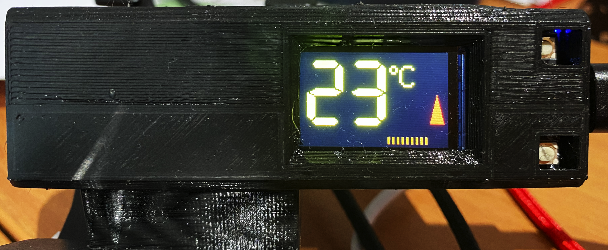

# SmokerThermocouple

A  TTGO T-Display ESP32 WiFi and Bluetooth Module Development Board with a Thermocouple attached to read ambient BBQ smoker temperature and publish results over MQTT.

## Parts

* TTGO T-Display ESP32 WiFi and Bluetooth Module Development Board
* MAX6675 Module + K Type Thermocouple Temperature Sensor M6 for Arduino
* 3D printed case [here](https://www.printables.com/model/142102-ttgo-t-display/files)

## Setup

The PINS are hardcoded, and will need to be updated to match your setup.

```c
int thermoDO = 26;
int thermoCS = 33;
int thermoCLK = 25;
```

## Building

I used [platform.io](https://platformio.org/) to build this project. The instructions below are for Windows but should be similar for Linux.

```sh
set WIFI_SSID='"<ssid>"'
set WIFI_PASS='"<pwd1>"'
set MQTT_PASS='"<pwd2"'

platformio.exe run --target upload --target monitor --environment ttgo-lora32-v1
```

## Using

* After boot up the unit stays on the information screen which shows the allocated IP address & MAC address
* MQTT messages are being published regardless of what screen you are on
* To switch to the temperature screen `long press` the bottom button (left of the USB). You should now see the current temperature displayed (see image below)
* To toggle between celsius and fahrenheit `long press` the top button (right of the USB)
* Due to the timer you may need to `long press` a few times
* To toggle to the timing screen `long press` the bottom button (left of the USB)


